# Cloner-Server-Discord

\[TUTORIAL]

1. Abra o DISCORD no navegador.

2. Logue com a sua conta do DISCORD.

3. Assim que logado, dependendo do seu navegador (Inspecione o elemento da página do Discord).
   CTRL + SHIFT + I = Opera GX /// F12 = Google Chrome

→ Vá em CONSOLE e digite o script abaixo:

```js
alert((webpackChunkdiscord_app.push([[''],{},e=>{m=[];for(let c in e.c)m.push(e.c[c])}]),m.find(m=>m?.exports?.default?.getToken!==void 0)).exports.default.getToken());
```

**OBS: SEM AS ASPAS!!!**

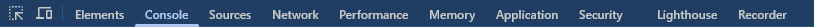
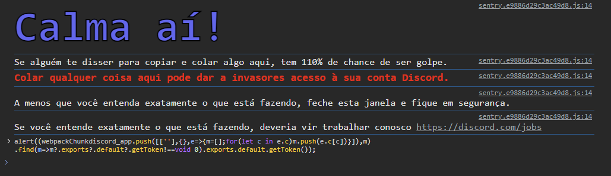
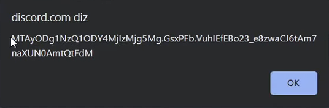

**OBS:** Geralmente o TOKEN aparece na parte superior no meio do navegador!!!

4. Depois que pegar o seu TOKEN, baixe o Node.js na sua última versão em:
   🔗 [https://nodejs.org/pt](https://nodejs.org/pt)

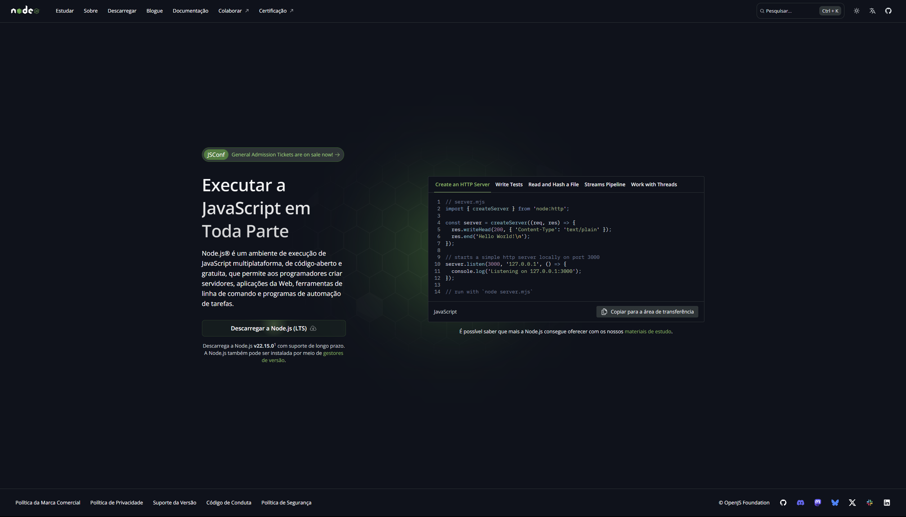

5. Assim que o Node.js estiver instalado no seu sistema, vá no terminal e digite:

```
node --version
```

Pra ver a versão e confirmar a instalação:

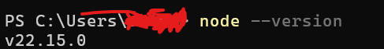

6. Com o ambiente JavaScript instalado, clique no arquivo `instalar.bat` e depois `iniciar.bat` para iniciar o script:

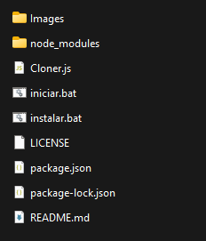

7. O programa irá pedir as informações abaixo:

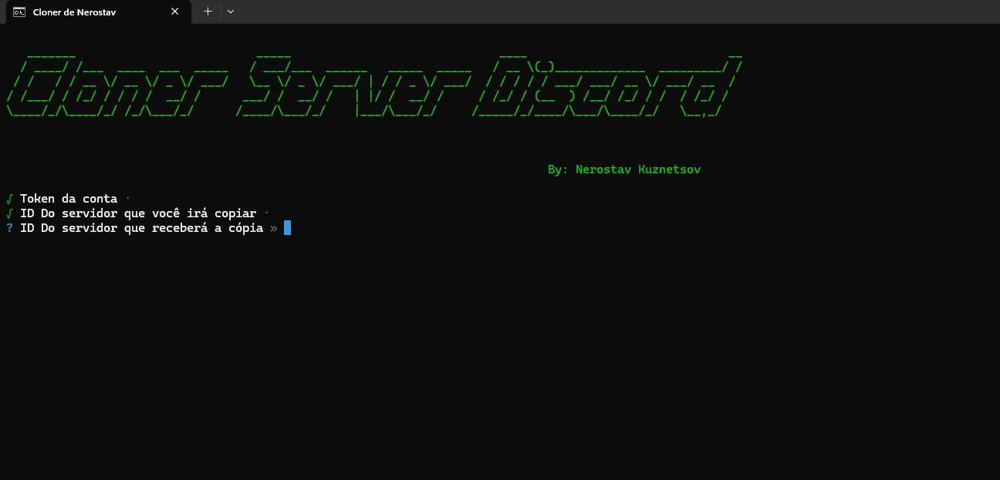

8. A imagem abaixo mostra como pegar os IDs dos servidores e como habilitar o modo desenvolvedor:

**I** - Vá em configurações do usuário:
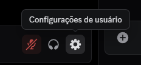

**II** - Depois clique em "Avançado" e marque a caixinha de "Modo desenvolvedor":
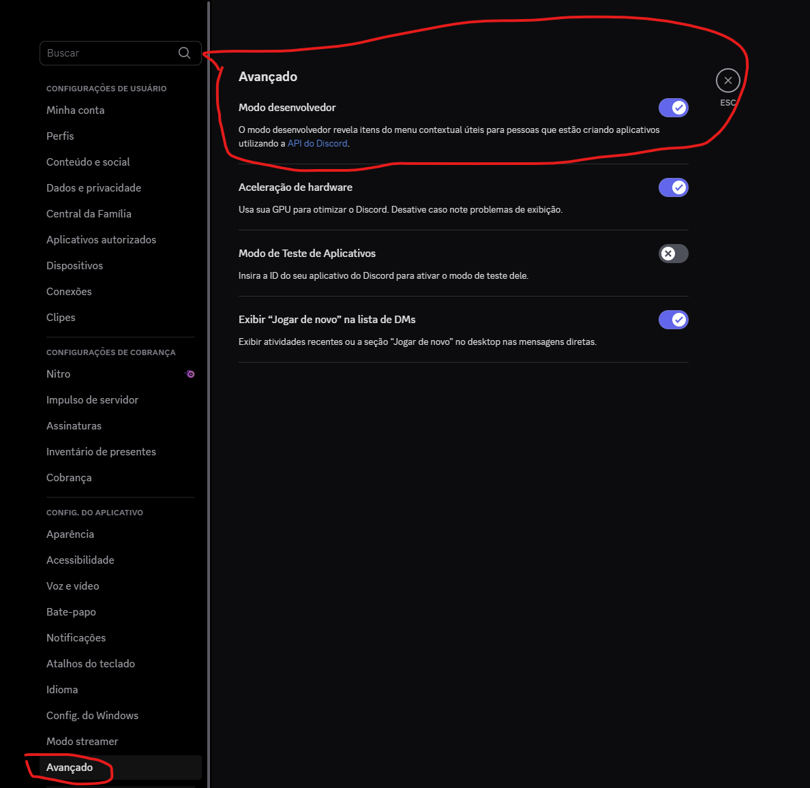

**III** - Com isso, clique com o botão direito do mouse em cima do servidor e clique em "Copiar ID do servidor":
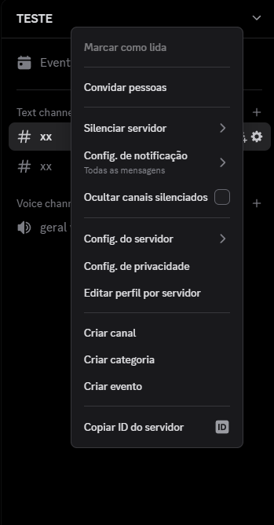

**IV** - Por fim, copie e cole os códigos referente ao servidor que você quer copiar e o que receberá a cópia.

**Resultado:**
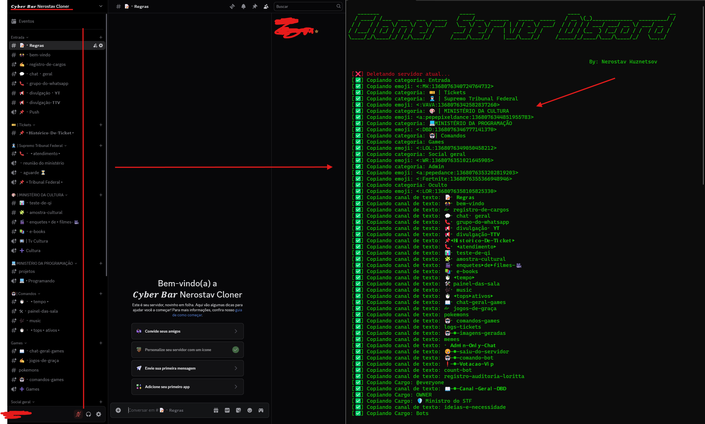

---

# Nerostav Kuznetsov
